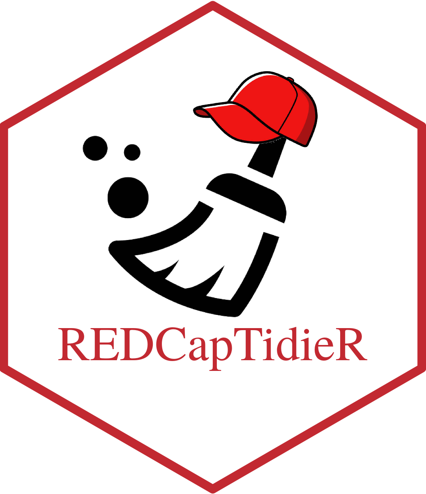

<!-- README.md is generated from README.Rmd. Please edit that file -->

```{r, include = FALSE}
knitr::opts_chunk$set(
  collapse = TRUE,
  comment = "#>",
  fig.path = "man/figures/README-",
  out.width = "100%"
)
```

# REDCapTidieR

<p align="center">



</p>

<!-- badges: start -->

[](https://lifecycle.r-lib.org/articles/stages.html#experimental) [](https://github.com/CHOP-CGTDataOps/REDCapTidieR/actions/workflows/R-CMD-check.yaml)

<!-- badges: end -->

[REDCap](https://www.project-redcap.org/) is a powerful database solution used by many research institutions:

> "REDCap is a secure web application for building and managing online surveys and databases. While REDCap can be used to collect virtually any type of data in any environment (including compliance with 21 CFR Part 11, FISMA, HIPAA, and GDPR), it is specifically geared to support online and offline data capture for research studies and operations."

The [`REDCapR`](https://ouhscbbmc.github.io/REDCapR/) package streamlines calls to the REDCap API. Its main use is to download records from a REDCap project and present it to the analyst as a data frame. This works well for simple projects, however becomes ugly when complex databases that include longitudinal structure and/or repeated instruments are involved.

The aim of `REDCapTidieR` is to make the life of analysts who deal with these complex databases easier. It does so by building upon `REDCapR` to make its output tidier. Instead of one large data frame, the analyst gets to work with a set of tidy tibbles, one for each instrument.

## Installation

You can install the development version of `REDCapTidieR` like so:

```{r, eval = FALSE}
devtools::install_github("CHOP-CGTDataOps/REDCapTidieR")
```

## Getting started

```{r}
library(REDCapTidieR)
library(magrittr)
```

The two main functions of `REDCapTidieR` are `read_redcap_tidy()` and `bind_tables()`. Here is how they can be used together to import all data from a REDCap project and present them as tidy tibbles in the global environment:

```{r, eval = FALSE}
read_redcap_tidy(redcap_uri, token) %>% 
  bind_tables()
```

## Details

### Structure of the tibble returned by `read_redcap_tidy`

The `read_redcap_tidy` function returns a tibble in which each row represents a REDCap instrument. The first column contains the instrument name. The second column is a **list column** containing a tibble for each instrument.

```{r, include = FALSE}
token <- Sys.getenv("REDCAPTIDIER_LONGITUDINAL_API")
redcap_uri <- Sys.getenv("REDCAP_URI")
```

```{r, message = FALSE}
redcap_export <- read_redcap_tidy(redcap_uri, token)

redcap_export
```

REDCap databases support two main mechanisms to allow collecting the same data multiple times: repeated instruments and longitudinal projects.

The granularity of each table (i.e. what a single row represents) depends on the structure of the database (classic, longitudinal with one arm, longitudinal with multiple arms) as well as whether the instruments are repeatable or not. Based on this, `REDCapTidieR` tibbles contain the following columns to uniquely identify a specific row:

+-----------------+--------------------------+-----------------------------+-----------------------------+
|                 | **Classic**              | **Longitudinal, one arm**   | **Longitudinal, multi-arm** |
+=================+==========================+=============================+=============================+
| **Nonrepeated** | `record_id`              | `record_id` +\              | `record_id` +\              |
|                 |                          | `redcap_event`              | `redcap_event` +\           |
|                 |                          |                             | `redcap_arm`                |
+-----------------+--------------------------+-----------------------------+-----------------------------+
| **Repeated**    | `record_id` +\           | `record_id` +\              | `record_id` +\              |
|                 | `redcap_repeat_instance` | `redcap_repeat_instance` +\ | `redcap_repeat_instance` +\ |
|                 |                          | `redcap_event`              | `redcap_event` +\           |
|                 |                          |                             | `redcap_arm`                |
+-----------------+--------------------------+-----------------------------+-----------------------------+

For example, the `repeated` instrument in the example database we just loaded is a repeated instrument from a multi-arm longitudinal project:

```{r}
redcap_export$redcap_data[[1]]
```

### Binding `REDCapTidieR` tibbles into an environment

The `bind_tables()` function takes the output of `read_redcap_tidy`, extracts the individual tibbles and binds them to an environment. By default, this is the global environment:

```{r, eval = FALSE}
ls()
```

```{r}
redcap_export %>%
  bind_tables()

ls()
```

Note that there are now three additional tibbles in the global environment.

## Getting help

If you encounter a bug, please file a minimal reproducible example on [github](https://github.com/CHOP-CGTDataOps/REDCapTidieR/issues). For questions and other discussion, please feel free to reach out to the authors by email.
