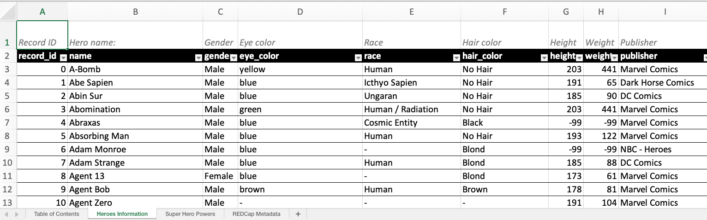

# Exporting to Excel

Excel spreadsheets are an accessible medium for data analysis and
collaboration. This vignette will guide you through the process of using
REDCapTidieR to transform your REDCap data into an XLSX document,
facilitating easy sharing with colleagues.

[`write_redcap_xlsx()`](https://chop-cgtinformatics.github.io/REDCapTidieR/reference/write_redcap_xlsx.md)
also works with
[`add_skimr_metadata()`](https://chop-cgtinformatics.github.io/REDCapTidieR/reference/add_skimr_metadata.md)
to supply both labelled and unlabelled skimr metadata metrics to your
XLSX document.

## Transforming a REDCap project into an XLSX document

The transformation of a REDCap
[project](https://chop-cgtinformatics.github.io/REDCapTidieR/articles/glossary.html#project)
into a XLSX document can be achieved in three straightforward steps
using the
[`write_redcap_xlsx()`](https://chop-cgtinformatics.github.io/REDCapTidieR/reference/write_redcap_xlsx.md)
function:

1.  Specify your REDCap URI and
    [API](https://chop-cgtinformatics.github.io/REDCapTidieR/articles/glossary.html#redcap-api)
    token.
2.  Invoke
    [`read_redcap()`](https://chop-cgtinformatics.github.io/REDCapTidieR/reference/read_redcap.md).
3.  Apply
    [`write_redcap_xlsx()`](https://chop-cgtinformatics.github.io/REDCapTidieR/reference/write_redcap_xlsx.md).

Below is a practical illustration:

``` r
library(REDCapTidieR)
```

``` r
redcap_uri <- "https://my.institution.edu/redcap/api/"
token <- "123456789ABCDEF123456789ABCDEF04"

my_redcap_data <- read_redcap(redcap_uri, token)
write_redcap_xlsx(my_redcap_data, file = "my_redcap_data.xlsx")
```

The resulting file will contain the data corresponding to each REDCap
[instrument](https://chop-cgtinformatics.github.io/REDCapTidieR/articles/glossary.html#instrument)
in a dedicated sheet. Additionally, a “Table of Contents” sheet will be
at the beginning, and a “REDCap Metadata” sheet will be at the end.

## Diving Deeper

We will revisit the Superheroes dataset from the [Getting
Started](https://chop-cgtinformatics.github.io/REDCapTidieR/articles/REDCapTidieR.html#case-study-the-superhero-database)
vignette.

First, we’ll use
[`read_redcap()`](https://chop-cgtinformatics.github.io/REDCapTidieR/reference/read_redcap.md)
to create the `superheroes`
[supertibble](https://chop-cgtinformatics.github.io/REDCapTidieR/articles/glossary.html#supertibble):

``` r
superheroes_token <- "123456789ABCDEF123456789ABCDEF04"
redcap_uri <- "https://my.institution.edu/redcap/api/"
```

``` r
superheroes <- read_redcap(redcap_uri, superheroes_token)

superheroes |>
  rmarkdown::paged_table()
```

The `superheroes` supertibble contains two rows, one for each
[instrument](https://chop-cgtinformatics.github.io/REDCapTidieR/articles/glossary.html#instrument)
of the Superheroes REDCap
[project](https://chop-cgtinformatics.github.io/REDCapTidieR/articles/glossary.html#project).
The
[`write_redcap_xlsx()`](https://chop-cgtinformatics.github.io/REDCapTidieR/reference/write_redcap_xlsx.md)
function, leveraging the
[openxlsx2](https://janmarvin.github.io/openxlsx2/) package, understands
the supertibble’s structure and creates a collaborator-friendly XLSX
file.

Let’s try it out!

``` r
superheroes |>
  write_redcap_xlsx(file = "superheroes.xlsx")
```

When you open the Excel document, you’ll see multiple sheets. The first
one is the **Table of Contents** sheet, followed by individual sheets
for each instrument’s data, and concluded with a **REDCap Metadata**
sheet.


Table of Contents sheet of `superheroes.xlsx`

The **Table of Contents** sheet provides an overview of the data present
in the rest of the document. If you wish to exclude this sheet, set the
`include_toc_sheet` argument of
[`write_redcap_xlsx()`](https://chop-cgtinformatics.github.io/REDCapTidieR/reference/write_redcap_xlsx.md)
to `FALSE`.

Each instrument’s data is contained in a separate sheet. For a better
understanding of how REDCapTidieR represents REDCap data, refer to the
**Diving Deeper** vignette.

The column headers come with pre-applied filters (notice the arrow on
the right side of each header cell), making data exploration
straightforward.


A data sheet of `superheroes.xlsx`

The **REDCap Metadata** sheet offers metadata for *all* fields from
*all* instruments in one place. If you don’t want this sheet, set the
`include_metadata_sheet` argument of
[`write_redcap_xlsx()`](https://chop-cgtinformatics.github.io/REDCapTidieR/reference/write_redcap_xlsx.md)
to `FALSE`.


REDCap Metadata sheet of `superheroes.xlsx`

### Applying Labels

Labels can offer valuable context to collaborators, helping them
understand the data in a specific column. The
[`make_labelled()`](https://chop-cgtinformatics.github.io/REDCapTidieR/reference/make_labelled.md)
function allows you to add [variable
labels](https://chop-cgtinformatics.github.io/REDCapTidieR/articles/glossary.html#variable-label)
to a REDCapTidieR
[supertibble](https://chop-cgtinformatics.github.io/REDCapTidieR/articles/glossary.html#supertibble),
and
[`write_redcap_xlsx()`](https://chop-cgtinformatics.github.io/REDCapTidieR/reference/write_redcap_xlsx.md)
can integrate these labels to the Excel sheets.

Let’s add variable labels to `superheroes` and export it to Excel:

``` r
superheroes |>
  make_labelled() |>
  write_redcap_xlsx("superheroes-labelled.xlsx")
```

Observe how the first row now contains a human-readable description for
each column.



Labelled supertbl output

### Recoding Logical Columns

By default,
[`write_redcap_xlsx()`](https://chop-cgtinformatics.github.io/REDCapTidieR/reference/write_redcap_xlsx.md)
recodes logical (`TRUE`/`FALSE`) columns into more human-friendly terms.
You can adjust this behavior using the `recode_logical` argument:

``` r
supertbl |>
  write_redcap_xlsx(recode_logical = TRUE)
```

[`write_redcap_xlsx()`](https://chop-cgtinformatics.github.io/REDCapTidieR/reference/write_redcap_xlsx.md)
uses the [field
label](https://chop-cgtinformatics.github.io/REDCapTidieR/articles/glossary.html#field-label)
to decide how to recode logical fields:

- Columns derived from **yesno** fields are recoded from `TRUE`/`FALSE`
  to `yes`/`no`
- Columns derived from **checkbox** fields are recoded from
  `TRUE`/`FALSE` to `Checked`/`Unchecked`
- Columns derived from **truefalse** fields are left as is
  (`TRUE`/`FALSE`)

Setting `recode_logical` to `FALSE` will preserve all logical fields as
(`TRUE`/`FALSE`).
