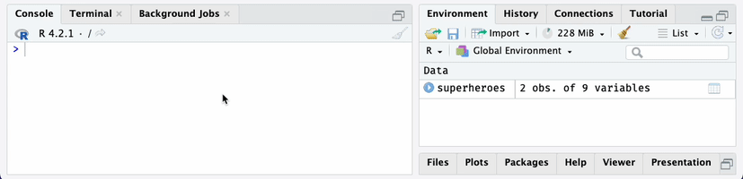

```{r, include = FALSE}
knitr::opts_chunk$set(
  collapse = TRUE,
  comment = "#>"
)
```

```{r, include=FALSE}
library(httptest)
# Make sure REDCapTidieR is attached so start_vignette() can find start-vignette.R
library(REDCapTidieR)

if (rlang::is_interactive()) {
  redcap_uri <- Sys.getenv("REDCAP_URI")
  token <- Sys.getenv("SUPERHEROES_REDCAP_API")
} else {
  start_vignette("REDCapTidieR")
  # creds object is created in start-vignette.R which gets sourced when start_vignette runs
  redcap_uri <- creds["REDCAP_URI"]
  token <- creds["SUPERHEROES_REDCAP_API"]
}
```

[REDCap](https://www.project-redcap.org/) is a powerful database solution used by many institutions around the world. The [REDCapR](https://ouhscbbmc.github.io/REDCapR/) package streamlines calls to the REDCap API. One of its main uses is to import records from a REDCap project. This works well for simple projects, however becomes ugly when complex databases that include longitudinal structure and/or repeated instruments are involved.

The REDCapTidieR package aims to make the life of analysts who deal with complex REDCap databases easier. It builds upon **REDCapR** to make its output **tidier**. Instead of one large data frame that contains all data from all instruments, the analyst gets to work with a set of tidy tibbles, one for each REDCap instrument.

## Case Study: The Superhero Database

Let's look at a REDCap database that has information about some 734 superheroes, derived from the [Superhero Database](https://www.superherodb.com/).

Here is a screenshot of the REDCap Status Dashboard of this database. Note that there are two instruments, **Heroes Information** which captures data about each individual superhero, and **Super Hero Powers** which captures each one of the superpowers that a specific superhero possesses.

<center>


</center>

## Importing data from REDCap

The `read_redcap_tidy` function is the workhorse of REDCapTidieR. It requires a REDCap database URI and a REDCap API token. *Note that you need to have API access to the REDCap database to use REDCapTidieR. You cannot use REDCapTidieR with files exported from REDCap.*

```{r}
library(REDCapTidieR)
superheroes <- read_redcap_tidy(redcap_uri, token)

superheroes |>
  dplyr::glimpse()
```

This returns a tibble with two rows. You might expect more rows from a database with 734 superheroes. `read_redcap_tidy` returns data in a special object, the **supertibble**, which contains a set of tidy tibbles, one for each REDCap instrument's data.

Each row of the supertibble corresponds to one REDCap instrument. The `redcap_form_name` and `redcap_form_label` columns identify that instrument. The `redcap_data` column contains a tidy tibble with its data. Similarly, the `redcap_metadata` column contains a tidy tibble with the REDCap metadata from that instrument. Additional columns contain useful information about the `redcap_data` tibble, such as the number of rows and columns, the size in memory, and the percentage of missing values.

## Exploring the contents of the supertibble

The supertibble is designed to be explored using the RStudio Data Viewer. Clicking on the table icon in the Environment tab opens a view of the supertibble. At a glance you see an overview of the instruments in the REDCap project.

<center>

{width=75%}

</center>

You can drill down into the individual data tables in the `redcap_data` and `redcap_metadata` columns. Note that in the `heroes_information` each row represents a superhero, identified by their `record_id`.

<center>

{width=75%}
</center>

In the `super_hero_powers` data tibble, each row represents a superpower of a specific hero. Each row is identified by the combination of `record_id` and `redcap_repeat_instance`. This difference in granularity is because `super_hero_powers` is a **repeating** instrument whereas `heroes_information` is a **nonrepeating** instrument.

<center>

{width=75%}
</center>

You can also explore the tibbles in the `redcap_metadata` column to find out about field labels, field types, and other field attributes.

<center>

{width=100%}

</center>

## Extracting tibbles from the supertibble

REDCapTidieR provides three different functions to extract tibbles with data from individual instruments from a supertibble.

### Binding tibbles into the environment

The `bind_tables` function takes a supertibble and binds individual instruments directly into the environment. Note how the `super_hero_powers` and `heroes_information` tibbles appear in the Environment pane.

<center>

{width=75%}

</center>

By default, `bind_tables` extracts all data tibbles from the supertibble. With the `tbls` argument you can specify a subset of tibbles that should be extracted. You can also supply your own environment object to which the tibbles will be added using the `environment` argument.

### Extracting a list of tibbles

The `extract_tables` function takes a supertibble and returns a list of tibbles. The default is to extract all tibbles.

```{r}
superheroes_list <- superheroes |>
  extract_tables()

superheroes_list |>
  str(max.level = 1)
```

You can use tidyselect semantics to select specific tibbles.

```{r}
superheroes |>
  extract_tables(ends_with("powers")) |>
  str(max.level = 1)
```

### Extracting a single tibble

The `extract_table()` takes a supertibble and returns a single tibble.

```{r}
superheroes |>
  extract_table("heroes_information")
```

## Adding variable labels with the labelled package

`REDCapTidieR` integrates with the [labelled](http://larmarange.github.io/labelled/) package to allow you to attach labels to variables in the supertibble. Variable labels can make data exploration easier. An increasing number of R packages support labelled data, including [ggplot](https://ggplot2.tidyverse.org/) (via [ggeasy](https://jonocarroll.github.io/ggeasy/)) and [gtsummary](https://www.danieldsjoberg.com/gtsummary/). The RStudio Data Viewer shows variable labels below variable names.

<center>

{width=75%}

</center>

The `make_labelled()` function takes a supertibble and returns a supertibble with variable labels applied to the variables of the supertibble as well as to the variables of all the tibbles in `redcap_data` and `redcap_metadata`.

The `labelled::look_for` function can be used to explore the variable labels of a tibble.

```{r}
superheroes |>
  make_labelled() |>
  bind_tables()

labelled::look_for(heroes_information)
```

Where did these labels come from? These labels are actually the REDCap field labels that prompt data entry in the REDCap instrument! REDCapTidieR places them into the `field_label` variable of the `redcap_metadata` tibble corresponding to the instrument.

<center>

{width=75%}

</center>

The label for `name` doesn't look quite right. Let's remove that trailing `:`. The `make_labelled` function has a `format_labels` argument that you can use to preprocess labels before applying them to the variables.

```{r}
superheroes |>
  make_labelled(format_labels = ~gsub(":", "", .)) |>
  bind_tables()

labelled::look_for(heroes_information, "hero")
```

Removing trailing `:` characters is a fairly common operation, so REDCapTidieR provides a helper function that can be passed to the `format_labels` argument:

```{r}
fmt_strip_trailing_colon("Hero name:")
```

See the other available helpers with `` ?`format-helpers` ``.

The `format_labels` argument will also accept a multiple functions in a vector or list. Any function that takes a character vector and returns a modified character vector can be used. `make_labelled` will process the variable labels using these functions in the order they are supplied. In the following example, we remove the trailing colon and make the labels lower case.

```{r}
superheroes |>
  make_labelled(
    format_labels = c(
      fmt_strip_trailing_colon, 
      base::tolower)
    ) |>
  bind_tables()

labelled::look_for(heroes_information)
```

```{r, include=FALSE}
end_vignette()
```
