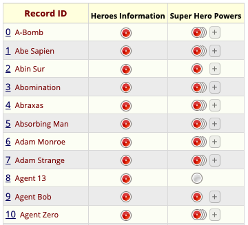

```{r, include = FALSE}
knitr::opts_chunk$set(
  collapse = TRUE,
  comment = "#>"
)
```

```{r, include=FALSE}
library(httptest)
# Make sure REDCapTidieR is loaded so httptest can find redact.R
library(REDCapTidieR)

# Use fake credentials if mocks exist, otherwise use real credentials to create mocks
fake <- dir.exists("REDCapTidieR")

redcap_uri <- REDCapTidieR:::get_credentials("REDCAP_URI", fake = fake)[[1]]
token <- REDCapTidieR:::get_credentials("SUPERHEROES_REDCAP_API", fake = fake)[[1]]

start_vignette("REDCapTidieR")
```

[REDCap](https://www.project-redcap.org/) is an electronic data capture software that is widely used in the academic research community. The [REDCapR](https://ouhscbbmc.github.io/REDCapR/) package streamlines calls to the REDCap API from an R environment. One of REDCapR's main uses is to [import](glossary.html#import) [records](glossary.html#record) from a REDCap [project](glossary.html#project). This works well for simple projects, however becomes [ugly](diving_deeper.html) when complex databases that include [longitudinal](glossary.html#longitudinal-project) structure and/or [repeating](glossary.html#repeating) [instruments](glossary.html#instrument) are involved.

The REDCapTidieR package aims to make the life of analysts who deal with complex REDCap databases easier. It builds upon **REDCapR** to make its output **tidier**. Instead of [one large data frame that contains all the data from your project](glossary.html#block-matrix), you get to work with a set of [tidy](glossary.html#tidy) [tibbles](glossary.html#tibble), one for each REDCap [instrument](glossary.html#instrument).

## Case Study: The Superhero Database

Let's look at a REDCap project that has information about some 734 superheroes, derived from the [Superhero Database](https://www.superherodb.com/).

Here is a screenshot of the REDCap Record Status Dashboard of this database. It has two instruments, **Heroes Information** which captures "demographic" data about each individual superhero such as their name, gender, and alignment (good or evil), and **Super Hero Powers** which captures each one of the superpowers that a specific superhero possesses.

<center>



</center>

## Importing data from REDCap

To [import](glossary.html#input) data from REDCap, use the `read_redcap()` function. `read_redcap()` requires a REDCap database URI and a [REDCap API](glossary.html#redcap-api) token. *You need to have API access to the REDCap database to use REDCapTidieR. REDCapTidieR does not work with files exported from REDCap.* We use it here to import data from the Superheroes database. You can see that it returns a [tibble](glossary.html#tibble) named `superheroes`. We use `rmarkdown::paged_table()` so you can explore this tibble.

```{r}
library(REDCapTidieR)
superheroes <- read_redcap(redcap_uri, token)

superheroes |>
  rmarkdown::paged_table()
```

You can see that the tibble that `read_redcap()` returned has only two [rows](glossary.html#row). This may be surprising because you might expect more rows from a database with 734 superheroes. `read_redcap()` returns data in a special object that we call the [**supertibble**](glossary.html#supertibble). The supertibble contains, among other things, tibbles with the data and metadata derived from each instrument. We call these the [**data tibbles**](glossary.html#data-tibble) and [**metadata tibbles**](glossary.html#metadata-tibble).

**Each row of the supertibble corresponds to one REDCap instrument**. The `redcap_form_name` and `redcap_form_label` [columns](glossary.html#column) identify which instrument the row relates to. The `redcap_data` column contains the data tibbles. The `redcap_metadata` column contains the metadata tibbles. Additional columns contain useful information about the data tibble, such as row and column counts, size in memory, and the percentage of missing values in the data.

## Exploring the contents of the supertibble

We designed the supertibble so you can explore it with the [RStudio Data Viewer](glossary.html#data-viewer). You can click on the table icon in the Environment tab to view of the supertibble in the data viewer. At a glance you see an overview of the instruments in the REDCap project.

<center>

{width=75%}

</center>

You can drill down into individual tables in the `redcap_data` and `redcap_metadata` columns. Note that in the `heroes_information` data tibble, each row represents a superhero, identified by their `record_id`.

<center>

{width=75%}

</center>

In the `super_hero_powers` data tibble, each row represents a superpower of a specific hero. Each row is identified by the combination of `record_id` and `redcap_form_instance`. This difference in [granularity](glossary.html#granularity) is because `super_hero_powers` is a [**repeating**](glossary.html#repeating) instrument whereas `heroes_information` is a [**nonrepeating**](glossary.html#nonrepeating) instrument.

<center>

{width=75%}

</center>

You can also explore the metadata tibbles in the `redcap_metadata` column to find out about [field labels](glossary.html#field-label), [field types](glossary.html#field-type), and other field attributes.

<center>

{width=75%}

</center>

## Extracting data tibbles from the supertibble

REDCapTidieR provides three different functions to extract data tibbles from a supertibble.

### Binding data tibbles into the environment

The `bind_tibbles()` function takes a supertibble and binds its data tibbles directly into the global [environment](glossary.html#environment). When you use `bind_tibbles()` while working interactively in the RStudio IDE, you will see data tibbles appear in the Environment pane.

<center>

{width=75%}

</center>

By default, `bind_tibbles()` extracts all data tibbles from the supertibble. With the `tbls` argument you can specify a subset of data tibbles that should be extracted. With the `environment` argument you can supply your own environment object to which the tibbles will be bound.

### Extracting a list of data tibbles

The `extract_tibbles()` function takes a supertibble and returns a named list of data tibbles. The default is to extract all data tibbles. We use `str` here to show the structure of the list returned by `extract_tibbles()`.

```{r}
superheroes_list <- superheroes |>
  extract_tibbles()

superheroes_list |>
  str(max.level = 1)
```

You can use [tidyselect selectors](https://tidyselect.r-lib.org/reference/language.html) to select specific data tibbles.

```{r}
superheroes |>
  extract_tibbles(ends_with("powers")) |>
  str(max.level = 1)
```

### Extracting a single data tibble

The `extract_tibble()` takes a supertibble and returns a single data tibble.

```{r}
superheroes |>
  extract_tibble("heroes_information") |>
  rmarkdown::paged_table()
```

### Memory considerations

You might wonder if it's memory efficient to have both the supertibble and the extracted tibbles in your environment. Because of R's [copy-on-modify behavior](https://adv-r.hadley.nz/names-values.html#copy-on-modify), extracted data tibbles actually use very little additional memory. To demonstrate this, here we check the size of the `superheroes` supertibble:

```{r}
lobstr::obj_size(superheroes)
```

If we bind the data tibbles into the environment and then check the combined size of the supertibble *and* the two data tibbles we get the following:

```{r}
superheroes |>
  bind_tibbles()

lobstr::obj_size(superheroes, heroes_information, super_hero_powers)
```

The same is true if we use the `extract_tibble()` or `extract_tibbles()` functions:

```{r}
a <- superheroes |> extract_tibble("heroes_information")
b <- superheroes |> extract_tibbles()

lobstr::obj_size(superheroes, a, b)
```

## Adding variable labels with the labelled package

REDCapTidieR integrates with the [labelled](glossary.html#labelled) package to allow you to attach labels to variables in the supertibble. Variable labels can make data exploration easier. An increasing number of R packages support labelled data, including [ggplot2](https://ggplot2.tidyverse.org/) (via [ggeasy](https://jonocarroll.github.io/ggeasy/)) and [gtsummary](https://www.danieldsjoberg.com/gtsummary/). The RStudio Data Viewer shows variable labels below variable names.

<center>

{width=75%}

</center>

The `make_labelled()` function takes a supertibble and returns a supertibble with [variable labels](glossary.html#variable-label) applied to the [variables](glossary.html#variable) of the supertibble as well as to the variables of all data and metadata tibbles in the `redcap_data` and `redcap_metadata` columns of the supertibble.

You can use the `labelled::look_for()` function to explore the variable labels of a tibble.

```{r}
superheroes |>
  make_labelled() |>
  bind_tibbles()

labelled::look_for(heroes_information)
```

Where did these labels come from? These labels are actually the REDCap [**field labels**](glossary.html#field-label) that prompt data entry in the REDCap instrument! REDCapTidieR places them into the `field_label` variable of the instrument's [metadata tibble](glossary.html#metadata-tibble). Below you can see that the field labels of the REDCap instrument for `heroes_information` are the same as the labels above.

<center>

{width=75%}

</center>

Note that the label for `name` has a trailing colon `:`. This won't look good as a variable label so let's remove it. The `make_labelled()` function has a `format_labels` argument that you can use to preprocess labels before applying them to variables.

```{r}
superheroes |>
  make_labelled(format_labels = ~ gsub(":", "", .)) |>
  bind_tibbles()

labelled::look_for(heroes_information, "hero")
```

Removing trailing `:` characters from a field label is a fairly common operation, so REDCapTidieR provides a [format helper function](glossary.html#format-helper) that you can pass to the `format_labels` argument:

```{r}
fmt_strip_trailing_colon("Hero name:")
```

To find out about other helpers included with REDCapTidieR, see `` ?`format-helpers` ``.

The `format_labels` argument will also accept multiple functions in a vector or list. You can pass any function that takes a character vector and returns a modified character vector to `format_labels`. `make_labelled()` will process the variable labels in the order that these functions are supplied. In the following example, we remove the trailing colon with `fmt_strip_trailing_colon()` and then make the labels lower case with `base::tolower()`.

```{r}
superheroes |>
  make_labelled(
    format_labels = c(
      fmt_strip_trailing_colon,
      base::tolower
    )
  ) |>
  bind_tibbles()

labelled::look_for(heroes_information)
```

## Adding summary statistics to the metadata with the skimr package

REDCapTidieR utilizes the [skimr](https://docs.ropensci.org/skimr/) package to generate summary statistics for [metadata tibbles](glossary.html#metadata-tibble). By employing the `add_skimr_metadata()` function, users can easily add these statistics as additional columns to their redcap_metadata tables. Below is a simple example, you may need to page over to the right to view the additional columns:

```{r}
superheroes %>% 
  add_skimr_metadata() %>%
  dplyr::select(redcap_metadata) %>% 
  purrr::pluck(1,1) %>% 
  rmarkdown::paged_table()
```

This integration enables quick insights into data content and supports exploratory data analytics. Outputs of `add_skimr_metadata()` can also be [labelled](glossary.html#labelled).

```{r, include=FALSE}
end_vignette()
```
